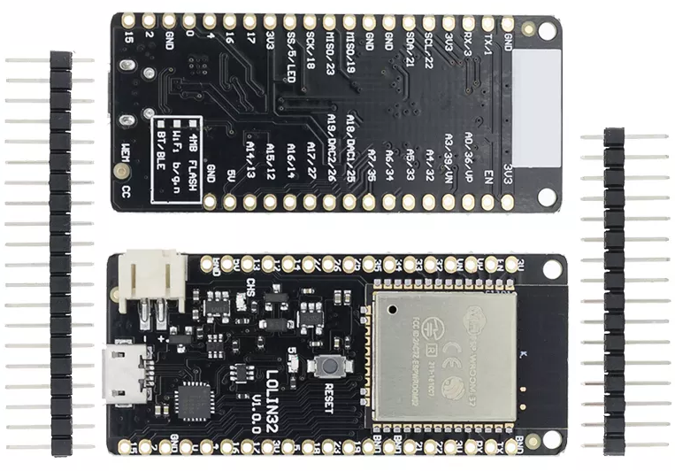
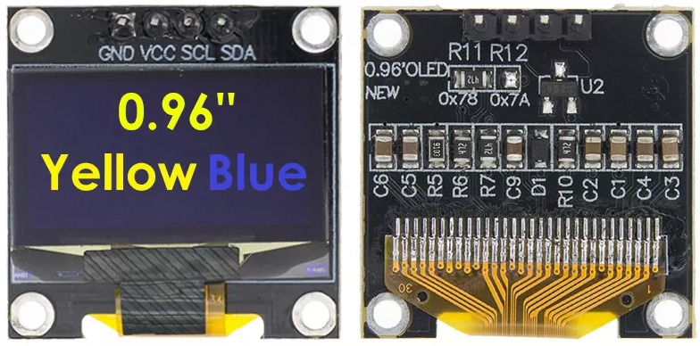
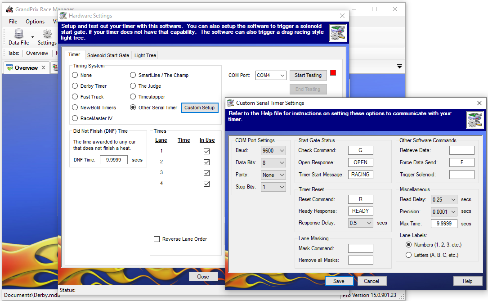

# Overview
This is a Pinewood Derby race timer software system designed to run on an ESP32-based microcontroller with support for a 128x32 monochrome SSD1306 OLED screen. Race results are shown on scren and relayed via serial connection (9600,8,N,1). Expects 4 racing lanes. Software tweaks could be made easily to support more (with most of the work to dispaly the results to the OLED screen).

Timing accuracy on the ESP32 hardware below is about two ten-thousandths of a second (0.0002). In other words, it takes .0002 seconds to loop through 4 sensors to determine if they are tripped.

A button press toggles between 3 display modes (race view, lane detection, and raw sensor output).

It's primarily designed to interface with a Windows laptop running the [GrandPrix Race Manager](http://grandprix-software-central.com/index.php/shopping/category/70-grandprix-race-manager) software, though it can likely be used with other derby management software.

### No Support For:
* Racing Light Tree
* Solenoid Gate Releases
* Lane Masking

Though it shouldn't be too difficult to add support for any of these.

## License
You cannot use this software or any derivative of it for commercial purposes (e.g. sell a hardware timer based off of this design/code). 

# Hardware
Designed for ESP32 WeMos Mini D1 ESP-WROOM-32.

## ESP32
* https://www.aliexpress.com/item/1005001621896126.html
* Cost: About $3.81 USD in March 2021, plus shipping.
* 
* 

## SSD1306 Serial OLED Screen
* https://www.aliexpress.com/item/1005001621806398.html
* Cost: About $1.80 USD in July 2021, plus shipping.
* 

## Other
* 2 Small LEDs (for gate status and racing status)
* Light-base lane sensors (tested with a set from an ancient [NewBold DT8000 Timer](https://www.pinewood-derby-timer.com/DT8000.html)); imagine most should work; software reads analog sensor expecting a fully-lit condition to register 4095, and a tripped-condition to be 3500 or less, though this can be tweaked in the code
* Miscellaneous Lane Connectors
* Gate Connector
* [Tactile Push Button Switches](https://www.aliexpress.com/item/32814651113.html)
* [3D Printable Enclosure - Fusion 360 File](docs/3D/ESP32DerbyRaceTimerBox].f3d)

# Compilation
Use [VSCode](https://code.visualstudio.com/Download). Install [PlatformIO extension](https://docs.platformio.org/en/latest/integration/ide/vscode.html). See [platformio.ini](platformio.ini) for configuration details.

# GrandPrix Race Manager Setups
Tested on GPRM15 and GPRM20. See [details here](http://grandprix-software-central.com/index.php/software/faq/search/cat/10-hardware-settings#faq_95).

